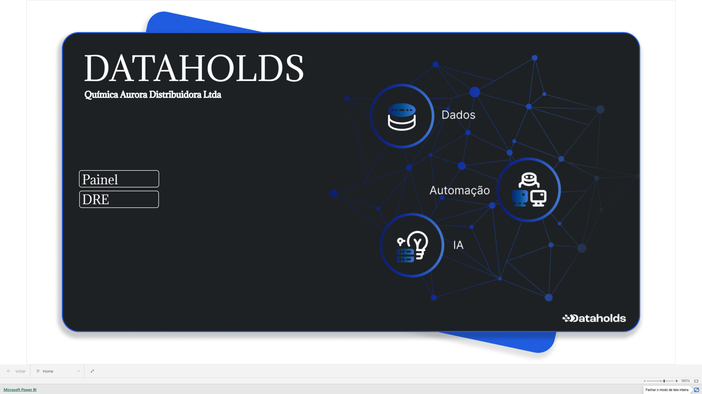

# Resolução do Caso Prático — Química Aurora Distribuidora Ltda
**Candidato:** Rodrigo Troskaitis  
**Processo Seletivo:** Analista de BI / Dados — Dataholds  
**Período de Análise:** 1º Trimestre / 2025 (Janeiro, Fevereiro e Março) | **Regime:** Competência  

---

> ### 🌐 Relatório Publicado Online
> O painel interativo desenvolvido em Power BI está disponível para visualização em:
>
> **[https://projetodataholds.netlify.app/](https://projetodataholds.netlify.app/)**
>
> O relatório foi publicado com o objetivo de demonstrar a usabilidade real do dashboard, simulando a experiência de navegação de um usuário final. A página conta com:
> - **Menus de navegação entre as telas** (Painel Gerencial e DRE HTML), permitindo alternar entre as visões sem necessidade de acesso ao Power BI Desktop;
> - **Menus do tipo hambúrguer** interativos nas laterais do relatório, recolhíveis, que organizam os filtros de período e os segmentadores de contexto — mantendo a área de visualização dos dados limpa e maximizada;
> - **Embed do relatório em iframe responsivo**, permitindo acesso pelo navegador em desktop ou mobile.

---

## 1. DRE Gerencial Mensal Consolidada (1T/2025)

Abaixo apresento a DRE consolidada por **regime de competência**, expurgando as movimentações de não-resultado (resgates e adiantamentos) e aplicando os tratamentos contábeis identificados:

| Linha da DRE | Jan/2025 | Fev/2025 | Mar/2025 | Total 1T2025 | AV % (s/ Rec. Líq.) |
|:---|---:|---:|---:|---:|:---:|
| **(+) Receita Bruta de Vendas** | R$ 270.018,60 | R$ 374.527,78 | R$ 486.624,18 | **R$ 1.131.170,56** | 109,6% |
| **(−) Deduções sobre Vendas (Impostos)** | (R$ 31.120,59) | (R$ 33.235,37) | (R$ 34.357,84) | **(R$ 98.713,80)** | -9,6% |
| **(=) Receita Operacional Líquida** | **R$ 238.898,01** | **R$ 341.292,41** | **R$ 452.266,34** | **R$ 1.032.456,76** | **100,0%** |
| **(−) Custo das Mercadorias (CMV)** | (R$ 192.636,83) | (R$ 270.594,61) | (R$ 297.554,91) | **(R$ 760.786,35)** | -73,7% |
| **(=) Lucro Bruto** | **R$ 46.261,18** | **R$ 70.697,80** | **R$ 154.711,43** | **R$ 271.670,41** | **26,3%** |
| *• Margem Bruta %* | *19,4%* | *20,7%* | *34,2%* | *26,3%* | — |
| **(−) Despesas Operacionais (SG&A)** | (R$ 127.553,56) | (R$ 91.695,43) | (R$ 113.231,11) | **(R$ 332.480,10)** | -32,2% |
| *• Salários e Encargos (4.01)* | (R$ 62.840,00) | (R$ 41.200,00) | (R$ 51.300,00) | (R$ 155.340,00) | -15,0% |
| *• Aluguel e Condomínio (4.02)* | (R$ 18.500,00) | (R$ 18.500,00) | (R$ 18.500,00) | (R$ 55.500,00) | -5,4% |
| *• Energia e Utilidades (4.03)* | (R$ 8.920,00) | (R$ 6.430,00) | (R$ 7.820,00) | (R$ 23.170,00) | -2,2% |
| *• Marketing e Comercial (4.04)\** | (R$ 12.450,00) | (R$ 8.900,00) | (R$ 14.100,00) | (R$ 35.450,00) | -3,4% |
| *• Fretes e Logística (4.05)* | (R$ 14.320,00) | (R$ 11.250,00) | (R$ 15.680,00) | (R$ 41.250,00) | -4,0% |
| *• Serviços de Terceiros (4.06)* | (R$ 10.523,56) | (R$ 5.415,43) | (R$ 5.831,11) | (R$ 21.770,10) | -2,1% |
| **(=) Resultado Operacional (EBITDA)** | **(R$ 81.292,38)** | **(R$ 20.997,63)** | **R$ 41.480,32** | **(R$ 60.809,69)** | **-5,9%** |
| **(−) Despesas Financeiras (Tarifas/Juros)** | (R$ 2.286,12) | (R$ 2.381,97) | (R$ 2.361,06) | **(R$ 7.029,15)** | -0,7% |
| **(+) Receitas Financeiras (Rendimentos CDB)** | **R$ 907,98** | **R$ 1.199,29** | **R$ 990,95** | **R$ 3.098,22** | **0,3%** |
| **(=) Resultado do Período (L/P)** | **(R$ 82.670,52)** | **(R$ 22.180,31)** | **R$ 40.110,21** | **(R$ 64.740,62)** | **-6,3%** |
| *Margem Líquida %* | *-34,6%* | *-6,5%* | **+8,9%** | *-6,3%* | — |

*\*Em janeiro, abati o estorno de comissão de R$ 7.000,00 (Lançamento 5031) diretamente na conta 4.04 (reduzindo o gasto da linha de R$ 19.450,00 para R$ 12.450,00).*

---

## 2. Reconciliação da Divergência: Quem está certo — o Sócio ou a Engenharia?

### O sócio está certo quanto ao resultado positivo de março (+R$ 40.110,21), mas sua percepção pelo extrato bancário continha distorções causadas por movimentações financeiras que não pertencem ao resultado.

A divergência ocorreu pelo confronto entre **Regime de Caixa (Extrato)** e **Regime de Competência (DRE)**, associado a falhas conceituais no relatório preliminar:

1. **A percepção do sócio no extrato bancário (Caixa):**  
   O saldo bancário em março foi impactado por duas movimentações expressivas que não configuram receita nem despesa operacional:
   - **Lançamento 5030 (12/03/2025):** Resgate de aplicação CDB no valor de **R$ 60.000,00** (transferência patrimonial entre contas da própria empresa).
   - **Lançamento 5034 (08/03/2025):** Adiantamento a fornecedor no valor de **R$ 22.000,00** (pagamento antecipado que ainda não se converteu em custo/despesa).
   - Esses R$ 82.000,00 transitaram pela conta bancária, mas **não compõem a DRE**.

2. **As possíveis inconsistências do relatório preliminar da engenharia:**  
   O relatório preliminar que indicava prejuízo incorreu em equívocos de apuração:
   - Pode ter considerado os R$ 22.000,00 de adiantamento a fornecedor como despesa de março;
   - Pode ter agrupado lançamentos por data de pagamento (caixa) em vez da competência;
   - Pode não ter contemplado o lote de notas emitidas no fechamento do mês.

3. **O resultado real por competência:**  
   Com a receita bruta crescendo **+29,9% MoM** em março e a margem bruta atingindo **34,2%**, a operação gerou um **Lucro Líquido de R$ 40.110,21 (Margem de 8,9%)**, superando o ponto de equilíbrio e revertendo as perdas de janeiro (-R$ 82,7k) e fevereiro (-R$ 22,2k).

---

## 3. Inconsistências Encontradas na Base e Tratamentos Adotados

| # | Inconsistência Encontrada | Impacto | Tratamento Adotado |
|:---:|:---|:---|:---|
| **1** | **Conta 5.02 (Rendimento CDB) ausente no Plano de Contas inicial** | Descartava ~R$ 1.000/mês de receitas financeiras em queries com `INNER JOIN`. | Apliquei `LEFT JOIN` e tratei a conta órfã via `COALESCE`, classificando-a no grupo **Receitas Financeiras** (+R$ 907,98 em Jan, +R$ 1.199,29 em Fev e +R$ 990,95 em Mar). |
| **2** | **Estorno de comissão lançado como 'entrada' em conta de despesa (Lançamento 5031)** | R$ 7.000,00 lançado como entrada na conta `4.04` (Marketing) em Jan/2025. | Tratei como **estorno**, abatendo o valor diretamente das despesas operacionais de janeiro (reduzindo de R$ 134,5k para R$ 127,5k). |
| **3** | **Notas Fiscais de Formaldeído (P011) sem custo preenchido em Março** | Notas `1176`, `1177`, `1178` e `1179` somam **R$ 64.446,80 em receita**, mas estão sem `custo_unitario` e `custo_total_item`. | Mantive temporariamente o custo como R$ 0 para fechar o cálculo com base nos dados disponíveis, mas **sinalizei o ponto**: quando o custo dessas notas for informado, o lucro de março terá um ajuste para baixo. |
| **4** | **Lançamentos e notas fiscais com status `cancelado`** | Risco de duplicar valores ou inflar despesas (ex: Lançamento 5032 de R$ 8.800 cancelado). | Filtrei `status_nota = 'emitida'` na tabela de vendas e `status = 'confirmado'` na tabela financeira. |
| **5** | **Movimentações de Não-Resultado (Contas 9.01 e 9.02)** | Resgate de CDB (R$ 60k) e Adiantamento (R$ 22k) distorceriam a DRE em R$ 82.000. | Criei regra de exclusão para contas dos grupos `Transferência entre Contas` e `Adiantamentos (não-resultado)`. |

## 4. Consultas SQL Desenvolvidas (Google BigQuery)

### Análise Exploratória dos Dados

Antes de escrever qualquer query de consolidação, realizei uma análise exploratória das três tabelas disponíveis para mapear a estrutura, qualidade e comportamento dos dados.

**Achados da exploração inicial:**

| Observação | Impacto Identificado |
|:---|:---|
| `notas_fiscais_itens` possui campo `status_nota` com valor `cancelado` | Sem filtro, valores cancelados seriam somados na receita e no CMV |
| `lancamentos_financeiros` possui `status = 'cancelado'` (ex: lançamento 5032, R$ 8.800) | Despesas canceladas inflavam o total de saídas |
| `plano_de_contas` usa `INNER JOIN` como padrão → conta 5.02 não mapeada | Rendimentos CDB (~R$ 3.098 no trimestre) eram silenciosamente descartados |
| Lançamento 5031: tipo `entrada` em conta de `saída` (4.04 — Marketing) | Sem tratamento, o valor de R$ 7.000 seria ignorado ou computado incorretamente |
| Contas 9.01 e 9.02: resgate CDB e adiantamento a fornecedor | R$ 82.000 em movimentações não-resultado precisavam ser excluídos da DRE |
| Campos `custo_total_item` nulos para produto P011 (Formaldeído) em março | CMV de março subestimado; margem bruta artificialmente elevada |
| `data_competencia` ≠ `data_pagamento` em vários lançamentos | Confirma que usar `data_pagamento` (caixa) produz divergências mensais |

**Estratégia de construção:** Com esse mapeamento, estruturei a query em quatro CTEs progressivas, cada uma responsável por uma camada de tratamento, isolando as regras de negócio para facilitar depuração e manutenção.

---

### BLOCO 1 — Receita Bruta e CMV: passo a passo

**O que precisávamos:** Totalizar receitas e custos das vendas por mês, usando a data de emissão da nota como critério de competência.

**Decisões tomadas:**
1. Usar `data_emissao` (não `data_pagamento`) → garante competência contábil
2. Filtrar `status_nota = 'emitida'` → exclui notas canceladas (ex.: nota 1172 cancelada que constava na base)
3. Limitar ao período Jan–Mar/2025 → foco no trimestre em análise
4. Agrupar por `ano_mes` para facilitar o JOIN posterior com os lançamentos financeiros

```sql
-- BLOCO 1: Faturamento e CMV por competência (apenas notas emitidas)
WITH vendas AS (
  SELECT
    FORMAT_DATE('%Y-%m', data_emissao)  AS ano_mes,
    EXTRACT(YEAR  FROM data_emissao)    AS ano,
    EXTRACT(MONTH FROM data_emissao)    AS mes,
    SUM(valor_total_item)               AS receita_bruta,
    SUM(custo_total_item)               AS cmv
  FROM `testesrh-508914`.quimica_aurora.notas_fiscais_itens
  WHERE
    status_nota = 'emitida'
    AND EXTRACT(YEAR FROM data_emissao) = 2025
    AND EXTRACT(MONTH FROM data_emissao) IN (1, 2, 3)
  GROUP BY 1, 2, 3
),
```

---

### BLOCO 2 — Lançamentos Classificados: passo a passo

**O que precisávamos:** Trazer todos os lançamentos financeiros válidos do período com sua classificação DRE, sem perder contas não mapeadas no plano de contas.

**Decisões tomadas:**
1. Usar `data_competencia` (não `data_pagamento`) → consistência com o regime de competência
2. Substituir `INNER JOIN` por `LEFT JOIN` no plano de contas → a conta 5.02 (Rendimento CDB) não estava cadastrada e era perdida no INNER JOIN
3. `COALESCE(pc.grupo_dre, 'Despesas Financeiras')` → atribui classificação padrão para contas órfãs, evitando NULL e garantindo que os rendimentos CDB caiam na linha correta
4. Filtro `status = 'confirmado'` → exclui lançamentos cancelados
5. Exclusão pós-COALESCE dos grupos não-resultado (`Transferência entre Contas` e `Adiantamentos (não-resultado)`) → o filtro precisa usar o valor já resolvido pelo COALESCE, não o campo bruto do plano

```sql
-- BLOCO 2: Classificação do razão financeiro com tratamento de contas órfãs e estornos
lancamentos_classificados AS (
  SELECT
    lf.id_lancamento,
    FORMAT_DATE('%Y-%m', lf.data_competencia)  AS ano_mes,
    EXTRACT(YEAR  FROM lf.data_competencia)    AS ano,
    EXTRACT(MONTH FROM lf.data_competencia)    AS mes,
    lf.historico,
    lf.tipo,
    lf.valor,
    lf.conta_id,
    COALESCE(pc.descricao_conta, '(sem cadastro no plano)') AS descricao_conta,
    COALESCE(pc.grupo_dre, CASE WHEN lf.conta_id = '5.02' THEN 'Receitas Financeiras' ELSE 'Despesas Operacionais' END) AS grupo_dre
  FROM `testesrh-508914`.quimica_aurora.lancamentos_financeiros lf
  LEFT JOIN `testesrh-508914`.quimica_aurora.plano_de_contas pc
         ON lf.conta_id = pc.conta_id
  WHERE
    lf.status = 'confirmado'
    AND EXTRACT(YEAR  FROM lf.data_competencia) = 2025
    AND EXTRACT(MONTH FROM lf.data_competencia) IN (1, 2, 3)
    -- Excluindo movimentações que não são resultado
    AND COALESCE(pc.grupo_dre, '') NOT IN ('Transferência entre Contas', 'Adiantamentos (não-resultado)')
),
```

---

### BLOCO 3 — Agrupamento Mensal: passo a passo

**O que precisávamos:** Consolidar os lançamentos em totais mensais por linha da DRE, aplicando a lógica de sinais corretamente.

**Decisões tomadas:**
1. Despesas Operacionais com lógica de estorno dupla: `tipo='saida'` soma como despesa; `tipo='entrada'` no mesmo grupo **subtrai** (abate o estorno do mês) → captura o lançamento 5031 de forma correta sem tratamento especial
2. Receitas Financeiras capturadas como `tipo='entrada'` no grupo `Despesas Financeiras` → a conta 5.02 cai nesse grupo via COALESCE, e o sinal de entrada a identifica como receita (não despesa)
3. Os sinais negativos finais (`* -1`) são aplicados apenas no SELECT final, mantendo os valores brutos nessa CTE para facilitar auditorias

```sql
-- BLOCO 3: Agrupamento financeiro mensal por grupo da DRE
financeiro_mes AS (
  SELECT
    ano_mes,
    ano,
    mes,
    SUM(CASE WHEN grupo_dre = 'Deduções sobre Vendas' AND tipo = 'saida' THEN valor ELSE 0 END) AS deducoes_vendas,
    -- Abatendo estornos (entradas em despesas operacionais, ex: lançamento 5031)
    SUM(CASE WHEN grupo_dre = 'Despesas Operacionais' AND tipo = 'saida' THEN valor
             WHEN grupo_dre = 'Despesas Operacionais' AND tipo = 'entrada' THEN -valor
             ELSE 0 END) AS despesas_operacionais,
    SUM(CASE WHEN grupo_dre = 'Despesas Financeiras' AND tipo = 'saida' THEN valor ELSE 0 END) AS despesas_financeiras,
    SUM(CASE WHEN grupo_dre IN ('Receitas Financeiras', 'Despesas Financeiras') AND tipo = 'entrada' THEN valor ELSE 0 END) AS receitas_financeiras
  FROM lancamentos_classificados
  GROUP BY 1, 2, 3
),
```

---

### BLOCO 4 — DRE Consolidada: passo a passo

**O que precisávamos:** Unir os dados de vendas (notas) com os financeiros (lançamentos) em uma única linha por mês, calculando cada linha da DRE de forma acumulativa.

**Decisões tomadas:**
1. `FULL OUTER JOIN` entre vendas e financeiro por `ano_mes` → garante que nenhum mês fique fora, mesmo que só tenha dados em uma das fontes
2. `COALESCE(..., 0)` em todos os campos → evita que NULLs contaminem os cálculos aritméticos
3. Cálculo progressivo e auditável: cada linha da DRE é escrita explicitamente (Receita Líquida = RB − Deduções; Lucro Bruto = RL − CMV; etc.) facilitando validação linha a linha

```sql
-- BLOCO 4: Consolidação final da DRE
dre AS (
  SELECT
    COALESCE(v.ano_mes, f.ano_mes) AS ano_mes,
    COALESCE(v.ano, f.ano)         AS ano,
    COALESCE(v.mes, f.mes)         AS mes,
    COALESCE(v.receita_bruta, 0)   AS receita_bruta,
    COALESCE(f.deducoes_vendas, 0) AS deducoes_vendas,
    COALESCE(v.receita_bruta, 0) - COALESCE(f.deducoes_vendas, 0) AS receita_liquida,
    COALESCE(v.cmv, 0)             AS cmv,
    COALESCE(v.receita_bruta, 0) - COALESCE(f.deducoes_vendas, 0) - COALESCE(v.cmv, 0) AS lucro_bruto,
    COALESCE(f.despesas_operacionais, 0) AS despesas_operacionais,
    COALESCE(f.despesas_financeiras, 0)  AS despesas_financeiras,
    COALESCE(f.receitas_financeiras, 0)  AS receitas_financeiras,
    COALESCE(v.receita_bruta, 0) - COALESCE(f.deducoes_vendas, 0) - COALESCE(v.cmv, 0)
      - COALESCE(f.despesas_operacionais, 0) - COALESCE(f.despesas_financeiras, 0) + COALESCE(f.receitas_financeiras, 0) AS resultado_periodo
  FROM vendas v
  FULL OUTER JOIN financeiro_mes f ON v.ano_mes = f.ano_mes
)
SELECT
  ano_mes AS mes,
  ROUND(receita_bruta, 2) AS receita_bruta,
  ROUND(deducoes_vendas, 2) * -1 AS deducoes_sobre_vendas,
  ROUND(receita_liquida, 2) AS receita_liquida,
  ROUND(cmv, 2) * -1 AS cmv,
  ROUND(lucro_bruto, 2) AS lucro_bruto,
  ROUND(despesas_operacionais, 2) * -1 AS despesas_operacionais,
  ROUND(despesas_financeiras, 2) * -1 AS despesas_financeiras,
  ROUND(receitas_financeiras, 2) AS receitas_financeiras,
  ROUND(resultado_periodo, 2) AS resultado_do_periodo
FROM dre
ORDER BY ano, mes;
```

---

## 5. Construção do Modelo no Power BI (`.pbip`)

Utilizei o formato Power BI Project (`.pbip` e TMDL) para versionamento contínuo. O relatório é composto por **duas telas** com propósitos complementares:

---

### Tela 1 — Painel Gerencial

Tela de **visão consolidada e analítica**, projetada para navegação rápida pelos principais indicadores do trimestre. Contém quatro blocos visuais:

1. **Cards de KPI (topo):**  
   Quatro cartões exibindo os indicadores críticos do período filtrado: Receita Líquida, Lucro Bruto, Total de Despesas Operacionais e Resultado do Período. Cada card apresenta o valor absoluto e a variação percentual em relação ao mês anterior (MoM%).

2. **Visão Cronológica (gráfico de linhas/barras):**  
   Gráfico de evolução mensal mostrando a trajetória da Receita Bruta, Lucro Bruto e Resultado do Período ao longo do trimestre. Permite identificar visualmente a recuperação progressiva de janeiro para março.

3. **Composição das Despesas Operacionais (tabela analítica):**  
   Visão tabular do SG&A discriminada por conta contábil (4.01 a 4.06), alimentada pela tabela `f_Despesas`. Exibe para cada categoria: o tipo de despesa, o valor absoluto do período e a representatividade percentual sobre o total de despesas operacionais, permitindo identificar rapidamente quais contas concentram maior peso no resultado.

4. **DRE como Matriz Nativa (Power BI Matrix visual):**  
   A DRE estruturada utilizando o visual de **Matriz nativa do Power BI**, com os meses nas colunas e as linhas da DRE nas linhas.

   > **Desafio técnico:** O Power BI não permite nativamente exibir meses nas colunas e medidas diferentes linha a linha em uma única Matriz — o visual aceita apenas uma medida por vez no campo Valores. Para contornar essa limitação, criei a tabela auxiliar `Painel` (com as linhas da DRE e ordenação explícita via `sortByColumn: ID`) e a medida dinâmica `[Painel1]`, que usa `SWITCH` sobre a linha selecionada para retornar o valor correto de cada linha da DRE. Dessa forma, uma única medida se comporta como N medidas distintas dependendo do contexto da linha, tornando possível a exibição completa da DRE com meses nas colunas dentro do visual nativo.

---

### Home


### Painel


### DRE


---

### Tela 2 — DRE HTML (Visão Executiva Customizada)

Tela dedicada ao **visual HTML avançado**, contendo exclusivamente a medida DAX `[DRE HTML]` renderizada em um visual de HTML nativo do Power BI.

**Características desta tela:**

- **Visão estática em colunas, mas visualmente elástica:** diferente da Matriz nativa, o visual HTML oferece controle total sobre tipografia, espaçamentos, hierarquia visual de subtotais, bordas coloridas, badges e microindicadores — aproximando-se da apresentação real de uma DRE corporativa.

- **Estrutura da DRE completa em uma única tela:** o visual ocupa 100% do espaço disponível, com scroll interno, exibindo em uma única leitura todas as linhas da DRE (Receita Bruta → Resultado do Período) com os três meses (Jan, Fev, Mar) e o Total do 1T/2025.

- **Indicadores embutidos:** além das linhas tradicionais da DRE, o visual incorpora diretamente:
  - Carga Tributária Efetiva (% Deduções / Receita Bruta);
  - Taxa de Absorção do CMV e Eficiência SG&A (% sobre Receita Líquida);
  - Margens Bruta, Operacional (EBITDA) e Líquida por mês;
  - Resultado Financeiro Líquido consolidado (Despesas Financeiras − Receitas Financeiras);
  - Variação MoM da Receita Bruta e do Resultado Líquido.

- **Cabeçalho dinâmico:** exibe a data e hora atual via `FORMAT(NOW(), "DD/MM/YYYY HH:mm")`, útil para rastreabilidade em apresentações.

- **Motivação:** criei essa estrutura com o objetivo de entregar algo **mais próximo da realidade das demonstrações financeiras corporativas**, onde o analista tem controle preciso sobre a apresentação — algo que o visual nativo de Matriz do Power BI não permite de forma nativa sem customização de temas complexos.

---

### Estrutura de Tabelas do Modelo:

- **`f_DRE` (Fato):** Conectada via Native Query ao BigQuery com *Query Folding* ativo.
- **`f_Despesas` (Fato Detalhada):** Query granular por conta contábil para alimentar gráficos analíticos de composição.
- **`d_Calendario` (Dimensão):** Tabela de datas com granularidade diária e hierarquias completas.
- **`Painel` (Dimensão Auxiliar):** Tabela com as linhas da DRE e ordenação explícita (`sortByColumn: ID`).
- **`Medidas`:** Tabela dedicada para centralizar todas as medidas DAX.

**Medida Dinâmica para a Matriz (`[Painel1]`):**  
Utiliza `SWITCH` e `FORMAT` para combinar valores monetários (`R$`) e percentuais (`%`) na mesma matriz, com tratamento de meses sem dados via `BLANK()` para evitar distorções de `-100%` nas métricas MoM.

---

## 6. Estrutura do Projeto

O repositório do projeto está organizado nas seguintes pastas e arquivos:

```
Rodrigo Troskaitis_Projeto Dataholds/
│
├── .fig/
│   └── PrototipagemProjectQuimicaAurora.fig   → Arquivo do projeto de prototipagem no Figma
│                                                 (layout das telas Painel e DRE, paleta de cores,
│                                                  grid e componentes visuais)
│
├── .png/
│   ├── DRE.png                                → Exportação da tela DRE (usada no Power BI como
│   │                                             imagem de fundo e referência de layout)
│   ├── Menu.png                               → Exportação do menu lateral / cabeçalho
│   └── [demais ativos visuais]                → Ícones, logotipos e backgrounds exportados
│                                                do Figma para uso no Power BI
│
├── BI DRE/
│   ├── BI Gerencial.pbip                      → Arquivo principal do projeto Power BI
│   │   (formato .pbip + TMDL para versionamento)
│   │   Contém: modelo semântico, medidas DAX, tabelas f_DRE,
│   │   f_Despesas, d_Calendario, Painel e Medidas
│   │
│   └── relatorio-dre.html                     → Página HTML publicada no Netlify
│       (https://projetodataholds.netlify.app/)
│       Embeds o relatório Power BI publicado via iframe,
│       com layout editorial e link de fallback
│
├── Entrega_Caso_Pratico_Quimica_Aurora.md     → Este documento (resolução completa do caso)
├── query_dre_gerencial.sql                    → Queries BigQuery completas com CTEs,
│                                               queries auxiliares (A, B, C) e comentários
└── Caso_Pratico_Analista_BI_Dataholds.docx   → Enunciado original do caso prático
```

---

## 7. Layout e Prototipagem no Figma (`.fig`)

Layout estruturado no Figma ([`.fig/PrototipagemProjectQuimicaAurora.fig`](file:///c:/Users/rodri/OneDrive/Documentos/Rodrigo%20Troskaitis_Projeto%20Dataholds/.fig/PrototipagemProjectQuimicaAurora.fig) e exportações em [`.png/`](file:///c:/Users/rodri/OneDrive/Documentos/Rodrigo%20Troskaitis_Projeto%20Dataholds/.png)):

1. **Definição Visual:**  
   - Tons escuros no plano de fundo (`#1E2235` e `#131622`) com cartões em contraste para conforto visual na leitura de dados contábeis.
   - Aplicação da identidade visual da Dataholds e logotipo no cabeçalho.

2. **Disposição dos Componentes:**  
   - **Menu Lateral e Cabeçalho ([`Menu.png`](file:///c:/Users/rodri/OneDrive/Documentos/Rodrigo%20Troskaitis_Projeto%20Dataholds/.png/Menu.png)):** Segmentadores de período e contexto da empresa.
   - **Cards Superiores:** KPIs de Receita Líquida, Lucro Bruto, Total de Despesas e Resultado do Período.
   - **Área Central ([`DRE.png`](file:///c:/Users/rodri/OneDrive/Documentos/Rodrigo%20Troskaitis_Projeto%20Dataholds/.png/DRE.png)):** Visão contábil estruturada (Matriz / Visual HTML).
   - **Área de Apoio:** Tabela analítica para composição das despesas operacionais (SG&A por conta contábil com valor e %) e gráfico de evolução mensal do faturamento e resultado.

---

## 8. Diagnóstico Técnico & Perguntas de Validação

Perguntas recomendadas antes de publicar a versão final:

1. **Ao Engenheiro de Dados / Responsável pelo ERP:**
   > *"Identifiquei que as notas 1176 a 1179 de Formaldeído (P011) emitidas em março totalizam R$ 64.446,80 em vendas, mas o campo de custo total veio vazio. Temos o custo de aquisição desse produto para calcular o CMV correto de março?"*

2. **Ao Departamento Contábil / Financeiro:**
   > *"O estorno de R$ 7.000,00 no lançamento 5031 refere-se ao cancelamento de comissão de marketing de janeiro ou de períodos anteriores? Confirmo o cadastro da conta 5.02 como Receita Financeira no plano de contas?"*

3. **À Engenharia que gerou o relatório preliminar:**
   > *"No relatório preliminar que apontou prejuízo em março, foram computados os R$ 22.000 de adiantamento a fornecedor (conta 9.02) ou o critério utilizado foi a data de pagamento em vez da competência?"*

---

## 9. Mensagem ao Cliente

> **Olá Rodrigo! tudo bem? Analisamos os dados do primeiro trimestre e verificamos que a sua percepção sobre março estava correta: o mês fechou no positivo, com lucro de aproximadamente R$ 40 mil.**
> 
> **A diferença em relação ao relatório preliminar aconteceu porque ele considerou movimentações de caixa que não representam resultado da operação. O resgate de R$ 60 mil do CDB foi apenas uma transferência entre contas da própria empresa, e os R$ 22 mil de adiantamento a fornecedor ainda não são custos deste mês. Separando essas movimentações e calculando as vendas faturadas, março foi o melhor mês do trimestre.**

